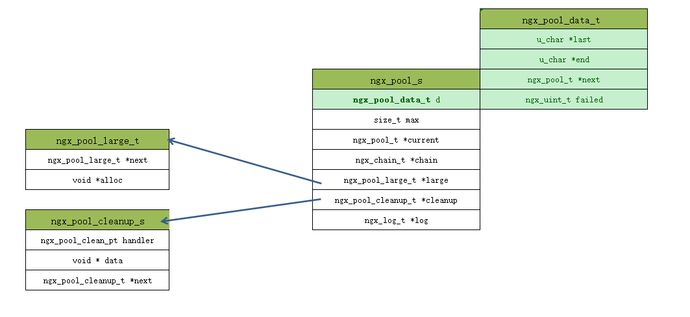
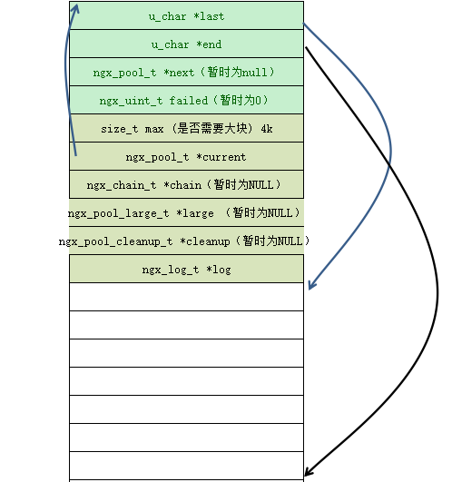
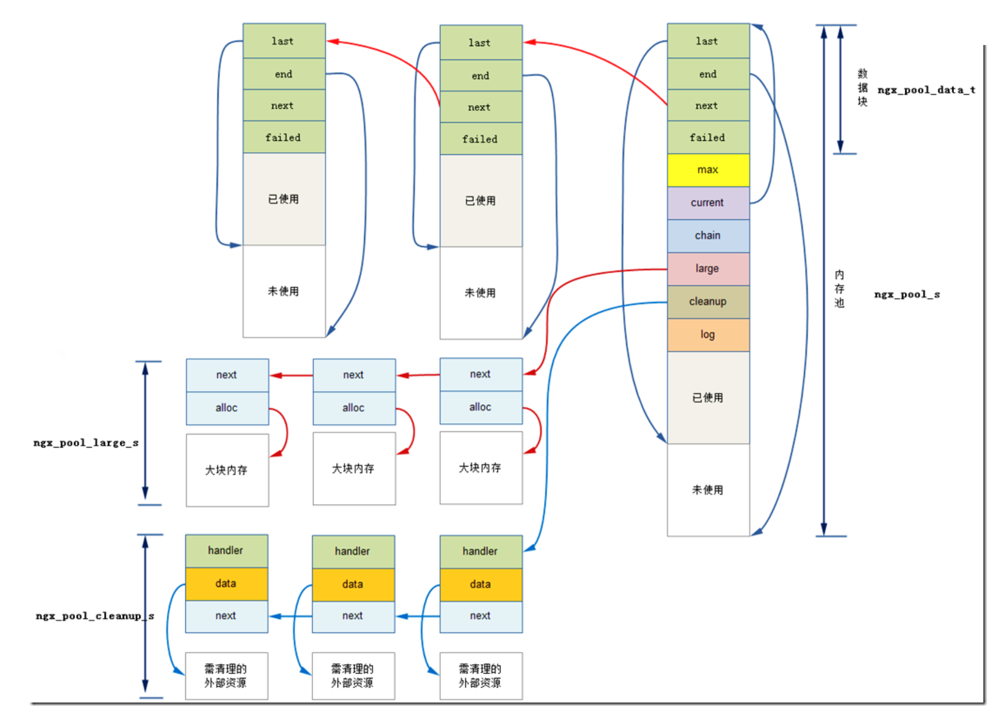
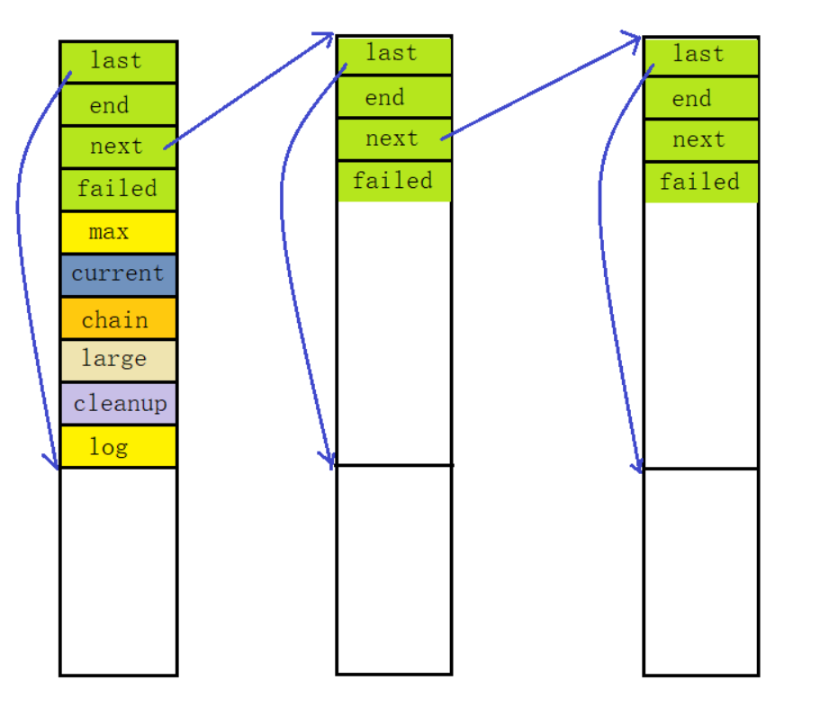
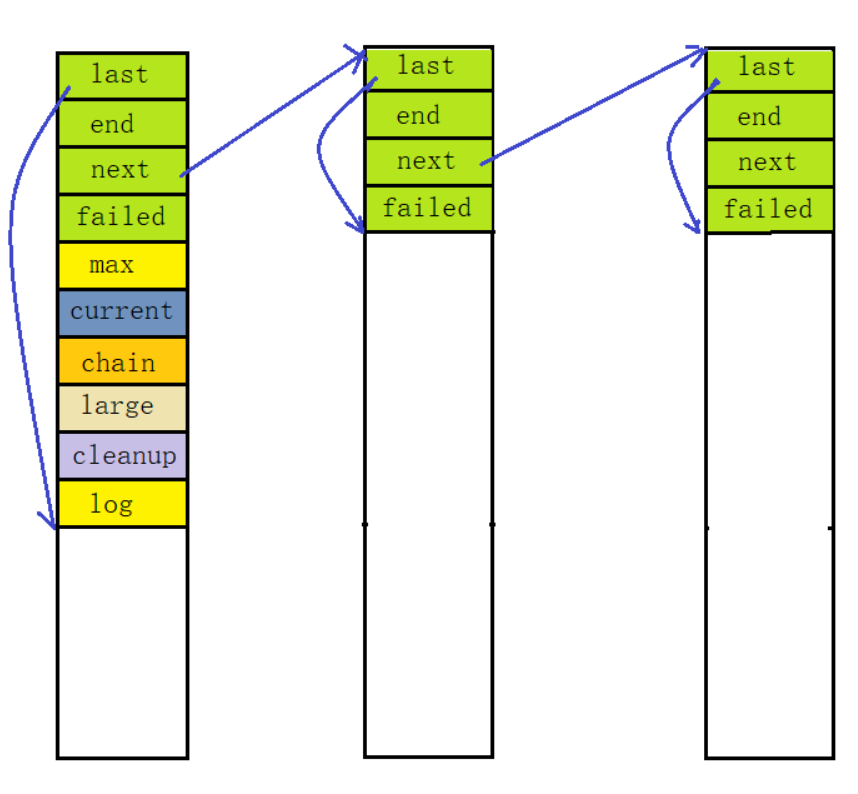
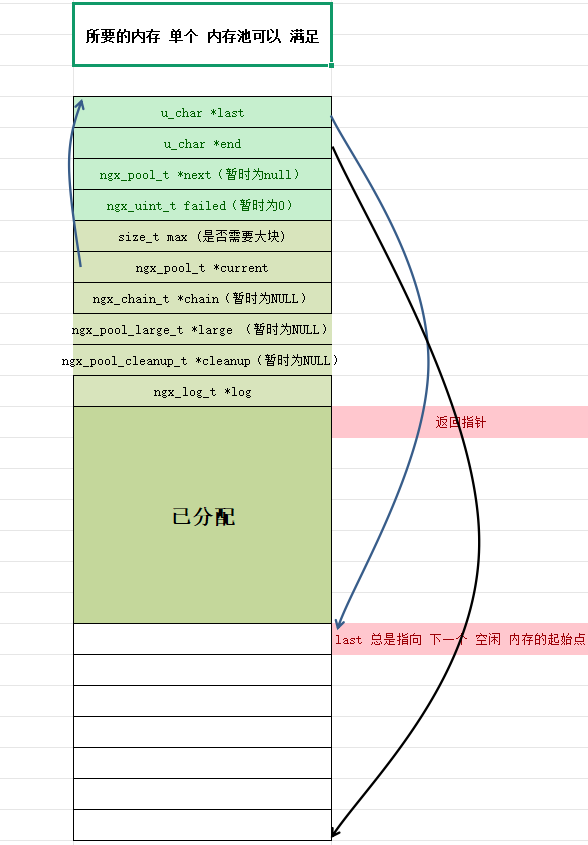
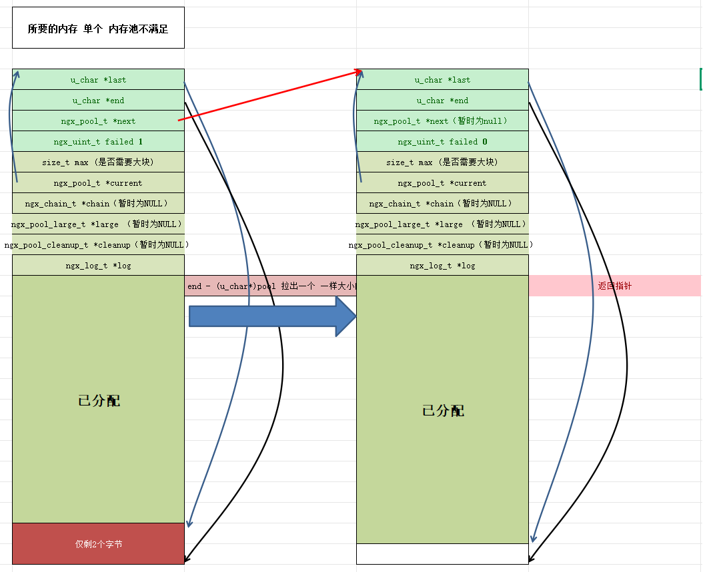
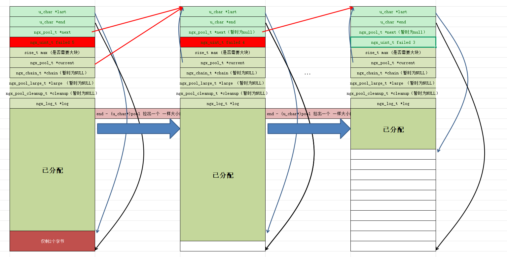
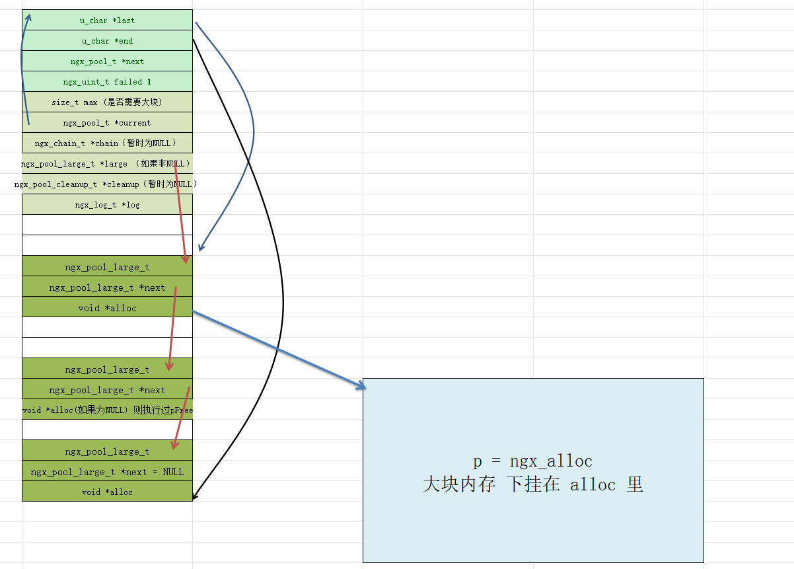
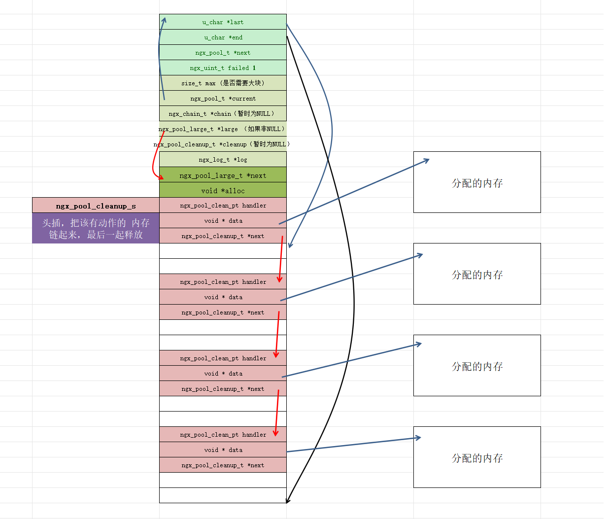

# 内存对齐

## 定义

- 内存对齐是一种计算机内存访问的优化策略。在计算机系统中，数据存储的地址通常要求按照一定的规则对齐。简单来说，就是数据存储的起始地址必须是某个特定值（通常是数据类型大小的倍数）的整数倍。例如，对于一个 4 字节的整数类型，其存储的起始地址最好是 4 的倍数。

## 目的

- **提高访问效率**：现代计算机处理器的内存访问是按块进行的，通常是字节对齐的。当数据按照内存对齐的方式存储时，处理器可以更高效地读取和写入数据。如果数据没有对齐，处理器可能需要进行多次内存访问才能读取或写入完整的数据，这会降低性能。
- **硬件兼容性**：一些硬件设备对内存访问有对齐要求。例如，某些 CPU 架构在访问未对齐的数据时可能会产生硬件异常或者性能下降。

# 内存池

```shell
src/core/ngx_palloc.c
src/core/ngx_palloc.h
os/unix/ngx_alloc.c
os/unix/ngx_alloc.h
```

## ngx_alloc

### ngx_alloc

本质上是对 malloc 的一层封装。

```c
void *
ngx_alloc(size_t size, ngx_log_t *log)
{
    void  *p;
    p = malloc(size);
    if (p == NULL) {
        ngx_log_error(NGX_LOG_EMERG, log, ngx_errno,
                      "malloc(%uz) failed", size);
    }
    return p;
}
```

### ngx_calloc

本质上是对 ngx_alloc 的封装，区别是会做 置 0 处理。

```c
void *
ngx_calloc(size_t size, ngx_log_t *log)
{
    void  *p;

    p = ngx_alloc(size, log);

    if (p) {
        ngx_memzero(p, size);	// 置 0 处理
    }

    return p;
}
```

### ngx_memalign

nginx 对此有两个封装，主要是 函数 `memalign()` 和 `posix_memalign()` 功能。

`memalign`函数不是标准的 POSIX 函数，它在一些系统中有实现，但可移植性相对较差。在 POSIX 兼容的系统中，更推荐使用`posix_memalign`。

因此，ngx_memalign 就是对 函数 `memalign()` 或 `posix_memalign()` 的一层封装而已。

- alignment 代表内存对齐的字节数。这个值必须是 2 的幂次方。
- size 代表要申请内存的大小，以字节为单位。

```c
void *
ngx_memalign(size_t alignment, size_t size, ngx_log_t *log)
{
    void  *p;

    p = memalign(alignment, size);
    if (p == NULL) {
        ngx_log_error(NGX_LOG_EMERG, log, ngx_errno,
                      "memalign(%uz, %uz) failed", alignment, size);
    }

    return p;
}
```

```c
void *
ngx_memalign(size_t alignment, size_t size, ngx_log_t *log)
{
    void  *p;
    int    err;

    err = posix_memalign(&p, alignment, size);

    if (err) {
        ngx_log_error(NGX_LOG_EMERG, log, err,
                      "posix_memalign(%uz, %uz) failed", alignment, size);
        p = NULL;
    }

    return p;
}
```

前面介绍的 alloc 大家都不陌生，但是当前这两个函数确少有人知。

`posix_memalign`和`memalign`函数主要用于在内存中按照指定的对齐方式分配内存块。

```tex
函数原型：int posix_memalign(void **memptr, size_t alignment, size_t size);
参数说明：
memptr：这是一个双重指针，用于存储分配的内存块的地址。如果函数调用成功，会将分配的对齐内存块的起始地址存储在*memptr中。
alignment：指定内存对齐的字节数。这个值必须是 2 的幂次方，例如 8、16、32 等。它定义了分配的内存块的起始地址应该是alignment的倍数。
size：要申请内存的大小，以字节为单位。

函数原型：void *memalign(size_t boundary, size_t size);
参数说明：
boundary：指定内存对齐的字节数，和posix_memalign的alignment类似，通常是 2 的幂次方。
size：要申请内存的大小，以字节为单位。
```

## ngx_palloc

### ngx_create_pool

```c
ngx_pool_t *
ngx_create_pool(size_t size, ngx_log_t *log)	// 创建一个内存池
{
    // 创建内存池
    ngx_pool_t  *p;

    p = ngx_memalign(NGX_POOL_ALIGNMENT, size, log);
    if (p == NULL) {
        return NULL;
    }

    // 初始化成员
    p->d.last = (u_char *) p + sizeof(ngx_pool_t);	// 可用空间起始地址
    p->d.end = (u_char *) p + size;	// 可用空间末尾地址
    p->d.next = NULL;	// 独立的一个内存池，暂时没有任何下一个内存池可指向
    p->d.failed = 0;

    size = size - sizeof(ngx_pool_t); // 计算出除去内存池结构体自身占用空间后剩余的可用内存大小
    p->max = (size < NGX_MAX_ALLOC_FROM_POOL) ? size : NGX_MAX_ALLOC_FROM_POOL; // 确定内存池单次最大可分配内存的上限值

    p->current = p;	// 独立的一个内存池，且有可用的空间，就指向自己
    p->chain = NULL;
    p->large = NULL;
    p->cleanup = NULL;
    p->log = log;

    return p;
}
```

从代码中可以看出，内存池对象的核心结构是 ngx_pool_t，即 ngx_pool_s（nginx 会做这种 typedef 操作，两者等价，以后不再赘述）。

完成基本初始化操作，只有 p、max、current、log 成员进行实际初始化，其他成员一律为 NULL。

```c
struct ngx_pool_s {
    ngx_pool_data_t       d; 		/* 内存池的数据区域*/
    size_t                max; 		/* 最大每次可分配内存 */
    ngx_pool_t           *current;  /* 指向当前的内存池指针地址。ngx_pool_t链表上最后一个缓存池结构*/
    ngx_chain_t          *chain;	/* 缓冲区链表 */
    ngx_pool_large_t     *large;    /* 存储大数据的链表 */
    ngx_pool_cleanup_t   *cleanup;  /* 可自定义回调函数，清除内存块分配的内存 */
    ngx_log_t            *log;      /* 日志 */
};
```

示意图：



ngx_pool_data_t 结构体：

```c
typedef struct {
    u_char               *last;  	// 内存池中未使用内存的开始节点地址
    u_char               *end;   	// 内存池的结束地址
    ngx_pool_t           *next;  	// 指向下一个内存池
    ngx_uint_t            failed;	// 失败次数
} ngx_pool_data_t;
```

在创建内存池对象之后，就对其进行初始化，来表明这个内存池对象的空间情况。



ngx_pool_cleanup_t 结构体：用于回收内存池

```c
struct ngx_pool_cleanup_s {
    ngx_pool_cleanup_pt   handler;  /* 清理的回调函数 */
    void                 *data; 	/* 指向存储的数据地址 */
    ngx_pool_cleanup_t   *next; 	/* 下一个ngx_pool_cleanup_t */
};
```

ngx_pool_large_s 结构体：用于大块分配

```c
struct ngx_pool_large_s {
    ngx_pool_large_t     *next;   /* 指向下一个存储地址 通过这个地址可以知道当前块长度 */
    void                 *alloc;  /* 数据块指针地址 */
};
```

### ngx_destroy_pool

就是将内存池进行资源回收，而资源回收先从内存池对象的内部成员开始，再从内存池对象本身下手。

```c
void
ngx_destroy_pool(ngx_pool_t *pool)
{
    ngx_pool_t          *p, *n;
    ngx_pool_large_t    *l;
    ngx_pool_cleanup_t  *c;

    // 回收 cleanup 链表
    for (c = pool->cleanup; c; c = c->next) {
        if (c->handler) {
            ngx_log_debug1(NGX_LOG_DEBUG_ALLOC, pool->log, 0,
                           "run cleanup: %p", c);
            c->handler(c->data);
        }
    }

#if (NGX_DEBUG)

    /*
     * we could allocate the pool->log from this pool
     * so we cannot use this log while free()ing the pool
     */

    for (l = pool->large; l; l = l->next) {
        ngx_log_debug1(NGX_LOG_DEBUG_ALLOC, pool->log, 0, "free: %p", l->alloc);
    }

    for (p = pool, n = pool->d.next; /* void */; p = n, n = n->d.next) {
        ngx_log_debug2(NGX_LOG_DEBUG_ALLOC, pool->log, 0,
                       "free: %p, unused: %uz", p, p->d.end - p->d.last);

        if (n == NULL) {
            break;
        }
    }

#endif

    // 回收 大块内存 链表
    for (l = pool->large; l; l = l->next) {
        if (l->alloc) {
            ngx_free(l->alloc);
        }
    }

    // 回收内存池
    for (p = pool, n = pool->d.next; /* void */; p = n, n = n->d.next) {
        ngx_free(p);

        if (n == NULL) {
            break;
        }
    }
}
```

示意图如下：



### ngx_palloc 和 ngx_pnalloc

前面已经创建好内存池，后面使用者就需要用这个内存池给自己分配空间：

```c
void *
ngx_palloc(ngx_pool_t *pool, size_t size)
{
#if !(NGX_DEBUG_PALLOC) // 如果设置 NGX_DEBUG_PALLOC 参数，就代表将不走小块分配
    if (size <= pool->max) {	
        return ngx_palloc_small(pool, size, 1);
    }
#endif

    return ngx_palloc_large(pool, size);
}


void *
ngx_pnalloc(ngx_pool_t *pool, size_t size)
{
#if !(NGX_DEBUG_PALLOC)
    if (size <= pool->max) {
        return ngx_palloc_small(pool, size, 0);
    }
#endif

    return ngx_palloc_large(pool, size);
}
```

区别在于，ngx_palloc_small 的第三个参数中，ngx_palloc 为 1，ngx_pnalloc 为 0，具体含义后面再做说明。

但至少，目前可以看到 nginx 的内存池在分配内存上，如果请求的大小 小于 当前内存池 一次性可分配的最大空间，就走小块分配，否则就走大块分配。

### ngx_reset_pool

```c
void
ngx_reset_pool(ngx_pool_t *pool)
{
    ngx_pool_t        *p;
    ngx_pool_large_t  *l;

    // 回收大块
    for (l = pool->large; l; l = l->next) {
        if (l->alloc) {
            ngx_free(l->alloc);
        }
    }

    // 内存池分配的空间不回收
    // 只是把 起始位置更新为最初可分配有效空间的起始位置，以及 failed 置为 0
    for (p = pool; p; p = p->d.next) {
        p->d.last = (u_char *) p + sizeof(ngx_pool_t);
        p->d.failed = 0;
    }

    pool->current = pool;
    pool->chain = NULL;
    pool->large = NULL;
}
```

示意图如下：



结合我们前面的源码分析，我们知道除了第一个内存池是通过 `p->d.last = (u_char *) p + sizeof(ngx_pool_t)` 来把可分配空间的起始地址放在 `sizeof(ngx_pool_t)`  之后。在后面创建的内存池都不是如此，`ngx_palloc_block` 函数中创建一个内存池，它是这样记录可分配空间的起始地址的，即 `m += sizeof(ngx_pool_data_t)`，也就是可分配的起始地址放在 `sizeof(ngx_pool_data_t)` 之后。

但是我们这里的重置代码并不合格，而是所有内存池统一选择  `sizeof(ngx_pool_t)`  处置，所以就一部分空间被浪费了。

Nginx 浪费空间来提升性能，已经是很常见了，这里它也是在一劳永逸？但是要实现合理的重置方式也并不难。

下面才是正确的做法：



而且看过 ngx_destory_pool 函数都知道，还有 cleanup 链表 没有回收。对于这种小块内存它没有进行回收，我想也是为了效率。

### ngx_palloc_small

```c
static ngx_inline void *
ngx_palloc_small(ngx_pool_t *pool, size_t size, ngx_uint_t align)
{
    u_char      *m;
    ngx_pool_t  *p;

    p = pool->current;  // 还有空间可分配的内存池对象

    do {
        m = p->d.last;  // 内存池还未使用部分的起始地址

        if (align) {
            m = ngx_align_ptr(m, NGX_ALIGNMENT);  // 内存对齐，浪费一部分空间，性能却有提升
        }

        if ((size_t) (p->d.end - m) >= size) {  // 剩余空间满足请求
            p->d.last = m + size; // 更新内存池剩余空间

            return m; // 返回分配空间的起始地址
        }

        p = p->d.next;  // 这块内存池不满足，寻找下一个内存池

    } while (p);  // 循环，知道所有内存池都不满足位置

    return ngx_palloc_block(pool, size);
}
```

首先，我们会找到一个有效的内存池对象地址，这只需要通过 pool 的 current 成员获取，它指向当前可用于分配的内存池指针地址。

接着，我们会获取内存池还未使用部分的起始地址。

如果 align = 1，针对指针类型进行类似的对齐操作。它将指针 `p` 按照指定的对齐要求 `a` 进行对齐，确保指针所指向的地址满足相应的内存对齐规则。

如果 align = 0，将不会进行上述操作。

前面我们已经获取可分配空间的起始地址 m，再接着获取结束地址与之求差得到当前内存池可分配的实际大小，如果 大于等于 就更新 d.last 信息，并返回可分配空间的起始地址 m。



如果当前内存池的可用空间无法满足的请求的话，就会寻找下一个可用内存池，进入循环中进行判断，直到一个可用的内存池为止。



那如果还是无法满足呢？也就是目前已有的内存池都无法满足的情况下，就会调用 `ngx_palloc_block(pool, size)` 。

### ngx_palloc_block

由于之前的内存池都已经不满足需求，因此就再创建一个同等大小的内存池，来满足需求。

```c
static void *
ngx_palloc_block(ngx_pool_t *pool, size_t size)
{
    u_char      *m;
    size_t       psize;
    ngx_pool_t  *p, *new;

    // 当前内存池实际大小，包括 可分配空间和内存池结构体自身的大小总和
    // 你可以理解为 完全复制一份和当前内存池一模一样的大小，只是大小
    psize = (size_t) (pool->d.end - (u_char *) pool);

    m = ngx_memalign(NGX_POOL_ALIGNMENT, psize, pool->log);
    if (m == NULL) {
        return NULL;
    }

    new = (ngx_pool_t *) m;

    new->d.end = m + psize;
    new->d.next = NULL;
    new->d.failed = 0;

    m += sizeof(ngx_pool_data_t);
    m = ngx_align_ptr(m, NGX_ALIGNMENT);
    new->d.last = m + size; // 更新已分配给用户申请的内存大小

    for (p = pool->current; p->d.next; p = p->d.next) {
        // 循环检查内存池失败过多次，如果超过 4 次 ，就将 current 更新为指向 下一个内存池，不再指向自己
        // 这样的好处就是，下次如果再来申请内存，就不会再去检查自己（可能对自己也失望了，别人的需求多次无法满足，这纯属个人玩笑）
        // 直接检查下一个内存池看能不能分配，如果下一个也不能分配，也就是下一个也没有指向自己，那就直接再去求下一个内存池
        // 所以，这里的这个设计非常巧妙，性能有所提升
        if (p->d.failed++ > 4) {
            pool->current = p->d.next;
        }
    }

    p->d.next = new;  // 把新分配的内存池记录下来

    return m;
}
```

巧妙设计部分对应的示意图：



### ngx_palloc_large

讲完之前的小块分配，就该到大块分配。

```c
static void *
ngx_palloc_large(ngx_pool_t *pool, size_t size)
{
    void              *p;
    ngx_uint_t         n;
    ngx_pool_large_t  *large;

    p = ngx_alloc(size, pool->log); // 申请大块内存
    if (p == NULL) {
        return NULL;
    }

    n = 0;

    // 如果是只有一个内存池，如下 if 语句内的代码不会被执行
    // 因为那个时候的 large 是 NULL，即还没有任何一块大块内存被分配过
    // 如果 large 不为 NULL，那就遍历 通过链表连接的这些 large 节点
    // large 节点记录着之前分配大块内存的信息
    // 如果 large->alloc == NULL，代表这块内存被释放了，直接通过  large->alloc = p 记录即可，并返回大块内存的起始地址
    // 如果 遍历次数 大于 3，那就不再继续了
    for (large = pool->large; large; large = large->next) {
        if (large->alloc == NULL) {
            large->alloc = p;
            return p;
        }

        if (n++ > 3) {
            break;
        }
    }

    // 调用 ngx_palloc_small 得到一块内存，从内存池中可分配空间得到一块
    large = ngx_palloc_small(pool, sizeof(ngx_pool_large_t), 1);
    // 如果内存池中无法得到 记录 p 信息的 large 对象
    // 那就释放为用户已经申请的内存，并返回 NULL
    if (large == NULL) {
        ngx_free(p);
        return NULL;
    }

    // 在 large 中记录已经分配的 大块内存 p
    large->alloc = p;
    large->next = pool->large;
    pool->large = large;

    return p;
}
```

从内存池中分配得到 large 对象，然后 large 记录大块内存示意图：



### ngx_pfree

前面刚刚讲到“如果 large->alloc == NULL，代表这块内存被释放了”，实际上就是 ngx_free 去释放掉大块内存。

```c
ngx_int_t
ngx_pfree(ngx_pool_t *pool, void *p)
{
    ngx_pool_large_t  *l;
  
    // 从给定的内存池中找到那个记录大块内存的地方
    // 然后 free 掉大块内存
    for (l = pool->large; l; l = l->next) {
        if (p == l->alloc) {
            ngx_free(l->alloc);
            l->alloc = NULL;

            return NGX_OK;
        }
    }

    return NGX_DECLINED;
}
```

### ngx_pool_cleanup_add

```c
ngx_pool_cleanup_t *
ngx_pool_cleanup_add(ngx_pool_t *p, size_t size)
{
    ngx_pool_cleanup_t  *c;

    c = ngx_palloc(p, sizeof(ngx_pool_cleanup_t));
    if (c == NULL) {
        return NULL;
    }

    if (size) {
        c->data = ngx_palloc(p, size);
        if (c->data == NULL) {
            return NULL;
        }

    } else {
        c->data = NULL;
    }

    c->handler = NULL;
    c->next = p->cleanup;

    p->cleanup = c;

    return c;
}
```

就是创建一个 ngx_pool_cleanup_t 对象，然后用 内存池的 cleanup 成员串起来，是个单链表串起来的。

### ngx_pool_run_cleanup_file

```c
void
ngx_pool_run_cleanup_file(ngx_pool_t *p, ngx_fd_t fd)
{
    ngx_pool_cleanup_t       *c;
    ngx_pool_cleanup_file_t  *cf;

    for (c = p->cleanup; c; c = c->next) {
        if (c->handler == ngx_pool_cleanup_file) {

            cf = c->data;

            if (cf->fd == fd) {
                c->handler(cf);
                c->handler = NULL;
                return;
            }
        }
    }
}
```

通过遍历内存池的 cleanup 中串联起来的 ngx_pool_cleanup_t 对象，然后调用 ngx_pool_cleanup_file 方法处理。

示意图如下：



### ngx_pool_cleanup_file

```c
void
ngx_pool_cleanup_file(void *data)
{
    ngx_pool_cleanup_file_t  *c = data;

    ngx_log_debug1(NGX_LOG_DEBUG_ALLOC, c->log, 0, "file cleanup: fd:%d",
                   c->fd);

    if (ngx_close_file(c->fd) == NGX_FILE_ERROR) {
        ngx_log_error(NGX_LOG_ALERT, c->log, ngx_errno,
                      ngx_close_file_n " \"%s\" failed", c->name);
    }
}
```

跟进去就会发现 ngx_close_file 为 close，也就是关闭文件描述符。

### ngx_pool_delete_file

```c
void
ngx_pool_delete_file(void *data)
{
    ngx_pool_cleanup_file_t  *c = data;

    ngx_err_t  err;

    // ngx_delete_file 就是 unlink，删除单个文件的硬链接
    // 它作用于文件系统的链接计数，当减少到0时，文件实质上会被删除
    if (ngx_delete_file(c->name) == NGX_FILE_ERROR) {
        err = ngx_errno;

        if (err != NGX_ENOENT) {
            ngx_log_error(NGX_LOG_CRIT, c->log, err,
                          ngx_delete_file_n " \"%s\" failed", c->name);
        }
    }

    // 关闭文件描述符
    // 如果 fd 是引用底层打开文件描述的最后一个文件描述符（参见 open (2)），则释放与打开文件描述相关的资源
    // 如果描述符是对已使用 unlink 删除的文件的最后一个引用，则删除该文件
    if (ngx_close_file(c->fd) == NGX_FILE_ERROR) {
        ngx_log_error(NGX_LOG_ALERT, c->log, ngx_errno,
                      ngx_close_file_n " \"%s\" failed", c->name);
    }
}
```

删除文件描述符，并且关闭文件描述符。
