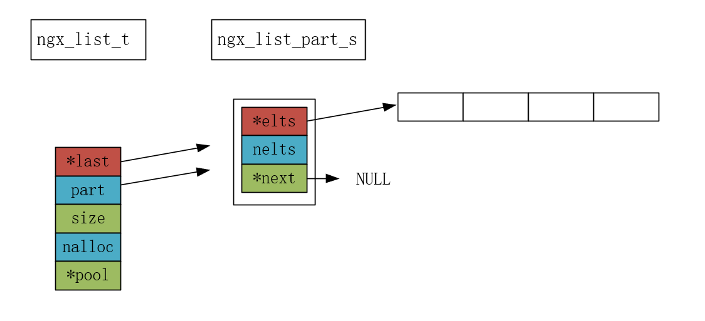
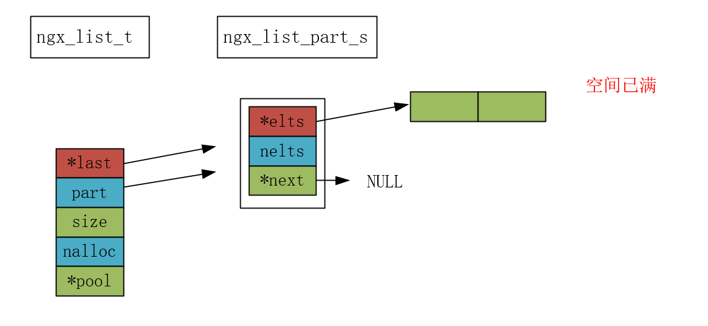
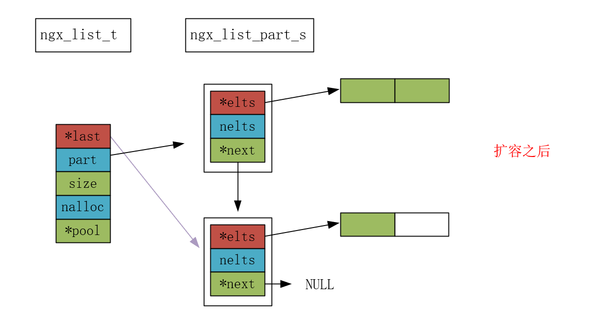

```c
src/core/ngx_list.h
src/core/ngx_list.c
```

# list 源码

```c
struct ngx_list_part_s {
    void             *elts;     // 节点内存的起始位置
    ngx_uint_t        nelts;    // 节点中已有元素个数
    ngx_list_part_t  *next;     // 指向下一个节点
};  // 链表节点


typedef struct {
    ngx_list_part_t  *last;     // 链表中的尾节点
    ngx_list_part_t   part;     // 链表中的头节点
    size_t            size;     // 节点中一个元素大小
    ngx_uint_t        nalloc;   // 节点中能存储元素个数
    ngx_pool_t       *pool;	    // 内存池
} ngx_list_t;   // 链表
```

## ngx_list_create 

```c
ngx_list_t *
ngx_list_create(ngx_pool_t *pool, ngx_uint_t n, size_t size)
{
    ngx_list_t  *list;

    list = ngx_palloc(pool, sizeof(ngx_list_t));    // 创建链表
    if (list == NULL) {
        return NULL;
    }

    if (ngx_list_init(list, pool, n, size) != NGX_OK) { // 初始化链表成员
        return NULL;
    }

    return list;
}
```

## ngx_list_init

```c
static ngx_inline ngx_int_t
ngx_list_init(ngx_list_t *list, ngx_pool_t *pool, ngx_uint_t n, size_t size)
{
    list->part.elts = ngx_palloc(pool, n * size);
    if (list->part.elts == NULL) {
        return NGX_ERROR;
    }

    list->part.nelts = 0;
    list->part.next = NULL;
    list->last = &list->part;
    list->size = size;
    list->nalloc = n;
    list->pool = pool;

    return NGX_OK;
}
```

示意图如下：



nalloc 为 4 ，代表可存放 4 个节点。

还可以明显看到，nginx 的链表中会提前创建出一个节点。到后面你就会看到，nginx 的链表中的节点，如果在没有扩容的情况下，是不会继续创建新节点的。因为它的数据存储在其他内存，这块内存起始地址由 elts 指针指向。

## ngx_list_push

```c
void *
ngx_list_push(ngx_list_t *l)
{
    void             *elt;
    ngx_list_part_t  *last;

    last = l->last; // 获取尾节点，只有尾节点指向的内存还有空间存数据

    if (last->nelts == l->nalloc) { // 扩容

        // 创建一个节点
        last = ngx_palloc(l->pool, sizeof(ngx_list_part_t));
        if (last == NULL) {
            return NULL;
        }

        // 给这个节点存储数据的地方申请内存
        last->elts = ngx_palloc(l->pool, l->nalloc * l->size);
        if (last->elts == NULL) {
            return NULL;
        }

        last->nelts = 0;	// 这个节点当前元素为 0
        last->next = NULL;	// next 指针 指向 NULL

        l->last->next = last;   // 当前节点指向 新节点
        l->last = last;         // 更新当前节点的尾节点
    }

    // nginx 的 list 不是创建一个一个节点来存储元素
    // nginx 的节点和数据是分离的，并不绑定到一块
    // 而是从当前节点的 elts 指针指向的内存取出一块给用户存储数据
    elt = (char *) last->elts + l->size * last->nelts;
    last->nelts++;

    return elt;
}
```

示意图：



空间不足，如果现在添加一个数据，将触发扩容。



# 基本使用

```c
typedef struct {
  int value;
} test_element_t;

void test_list() {
    // 创建内存池
    ngx_pool_t *ngx_pool = ngx_create_pool(2048, NULL);

    ngx_list_t* ngx_list = ngx_list_create(ngx_pool,2,sizeof(test_element_t));

    test_element_t* index1 = ngx_list_push(ngx_list);
    index1->value = 10;
    test_element_t* index2 = ngx_list_push(ngx_list);
    index2->value = 20;
    
    // 扩容，看到 last 的变化
    test_element_t* index3 = ngx_list_push(ngx_list);
    index3->value = 30;

    // 遍历 ngx_list_t
    ngx_list_part_t *part = &ngx_list->part;
    test_element_t *data = part->elts;  // 当前部分的元素数组
    for (unsigned int i = 0; ; i++) {
        if (i >= part->nelts) { // 当前部分遍历结束，切换到下一部分
            if (part->next == NULL) {
                break; // 没有下一部分，退出循环
            }
            part = part->next;
            data = part->elts;
            i = 0; // 重置索引为 0
        }
        printf("Element value: %d\n", data[i].value);
    }
}
```