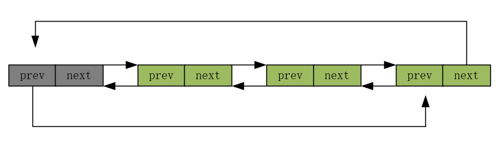
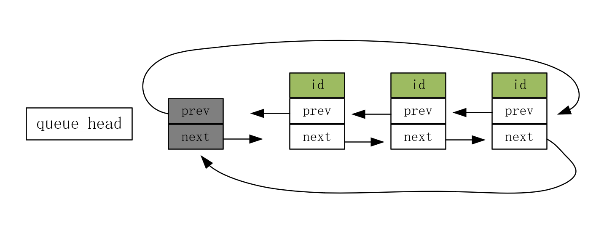

```c
src/core/ngx_queue.h
src/core/ngx_queue.c
```

# queue 源码

```c
struct ngx_queue_s {
    ngx_queue_t  *prev; // 前驱节点
    ngx_queue_t  *next; // 后驱节点
};
```

下面是链表基本操作的实现：

```c
// 初始化链表，前驱和后驱都指向自身
// 可以把这个节点理解为虚拟头节点，用来方便实现链表相关操作
#define ngx_queue_init(q)                                                     \
    (q)->prev = q;                                                            \
    (q)->next = q

// 节点的前驱节点指向自己，为空
#define ngx_queue_empty(h)                                                    \
    (h == (h)->prev)

// 头插法
// 通过这个地方也可以确定 nginx 双向链表确确实实 用到虚拟头节点
#define ngx_queue_insert_head(h, x)                                           \
    (x)->next = (h)->next;                                                    \
    (x)->next->prev = x;                                                      \
    (x)->prev = h;                                                            \
    (h)->next = x


#define ngx_queue_insert_after   ngx_queue_insert_head

// 尾插法
#define ngx_queue_insert_tail(h, x)                                           \
    (x)->prev = (h)->prev;                                                    \
    (x)->prev->next = x;                                                      \
    (x)->next = h;                                                            \
    (h)->prev = x


#define ngx_queue_insert_before   ngx_queue_insert_tail

// 获取头节点
#define ngx_queue_head(h)                                                     \
    (h)->next

// 获取尾节点
#define ngx_queue_last(h)                                                     \
    (h)->prev

//
#define ngx_queue_sentinel(h)                                                 \
    (h)

// 获取后驱节点
#define ngx_queue_next(q)                                                     \
    (q)->next

// 获取前驱节点
#define ngx_queue_prev(q)                                                     \
    (q)->prev


#if (NGX_DEBUG)

#define ngx_queue_remove(x)                                                   \
    (x)->next->prev = (x)->prev;                                              \
    (x)->prev->next = (x)->next;                                              \
    (x)->prev = NULL;                                                         \
    (x)->next = NULL

#else

// 删除指定节点
#define ngx_queue_remove(x)                                                   \
    (x)->next->prev = (x)->prev;                                              \
    (x)->prev->next = (x)->next

#endif

// 切割链表
// 原链表以 q 为起点断开，生成的新链表以 n 为头节点
#define ngx_queue_split(h, q, n)                                              \
    (n)->prev = (h)->prev;                                                    \
    (n)->prev->next = n;                                                      \
    (n)->next = q;                                                            \
    (h)->prev = (q)->prev;                                                    \
    (h)->prev->next = h;                                                      \
    (q)->prev = n;

// 尾部添加一个链表
// 将链表 `(n)` 的所有节点追加到链表 `(h)` 的末尾
#define ngx_queue_add(h, n)                                                   \
    (h)->prev->next = (n)->next;                                              \
    (n)->next->prev = (h)->prev;                                              \
    (h)->prev = (n)->prev;                                                    \
    (h)->prev->next = h;
```

示意图：



可就只有这个，该怎么使用呢？即只有和数据扯上关系，才可以和业务打交道，nginx 的双向链表是把数据分离出去的。

你如果想让你的结构体具备双向链表的功能，那就加入一个 ngx_queue_s 成员即可。见下：

```c
struct Node{
	void* data;
	ngx_queue_s queue;
}
```

问题是我们如何获取数据 data 呢？

## ngx_queue_data

其中`q`为寄宿链表变量，`type`为寄宿链表所在结构体的类型，`link`为寄宿链表在`type`结构体中的变量名。

```c
#define ngx_queue_data(q, type, link)                                         \
    (type *) ((u_char *) q - offsetof(type, link))
```

`offsetof(type, link)` 宏函数，用于获取 `link` 成员相对于其结构体 `type` 起始地址的偏移量（以字节为单位），即这个宏返回宿主结构体的首地址。

通过该宏，可以将链表操作与具体数据结构解耦，使链表可以用于多种数据结构。

比方说，当我们操作链表时，只能得到节点指针 `queue_node`。但是我们需要恢复到 `MyStruct`，以访问它的其他成员。

```c
typedef struct {
    int id;
    ngx_queue_t queue_node; // 链表节点
} MyStruct;

ngx_queue_t queue_head; // 链表头
```

## 完整示例

```c
// 遍历链表
void ngx_queue_print(ngx_queue_t *head) {
    ngx_queue_t *current = head->next;

    while (current != head) {
        // 使用 ngx_queue_data 从节点恢复到 MyStruct
        MyStruct *data = ngx_queue_data(current, MyStruct, queue);
        printf("ID: %d\n", data->id);
        current = current->next;
    }
}

int main() {
    // 定义链表头
    ngx_queue_t queue_head;
    ngx_queue_init(&queue_head);

    // 创建一些 MyStruct 数据
    MyStruct a = {1, {NULL, NULL}};
    MyStruct b = {2, {NULL, NULL}};
    MyStruct c = {3, {NULL, NULL}};

    // 将节点插入链表
    ngx_queue_insert_head(&queue_head, &a.queue);
    ngx_queue_insert_head(&queue_head, &b.queue);
    ngx_queue_insert_head(&queue_head, &c.queue);

    // 遍历链表并打印每个结构体的 ID
    printf("链表内容:\n");
    ngx_queue_print(&queue_head);

    return 0;
}
```

示意图：

