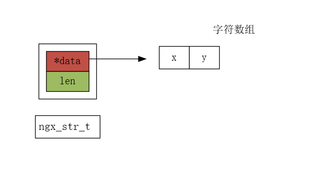

```tex
src/core/ngx_string.h
src/core/ngx_string.c
```

# string 源码

ngx_string 有很多的操作，但是并不会去讲解这部分源码，而是看看结构的设计。

```c
typedef struct {
    size_t      len;    // 长度
    u_char     *data;   // 首地址
} ngx_str_t;    // 字符串
```

示意图：



从图中可知，len 为 2。

也可以看得出来，nginx 的字符串 是一个字符数组，其中记录有字符串长度的信息。

下面是初始化字符串的方式：

```c
#define ngx_string(str)     { sizeof(str) - 1, (u_char *) str }
```

