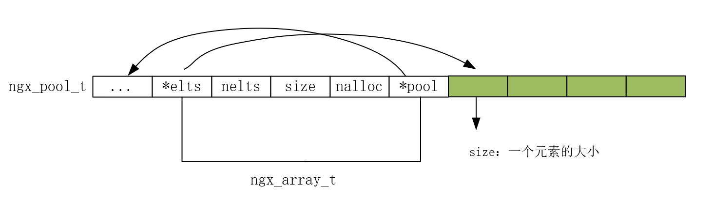
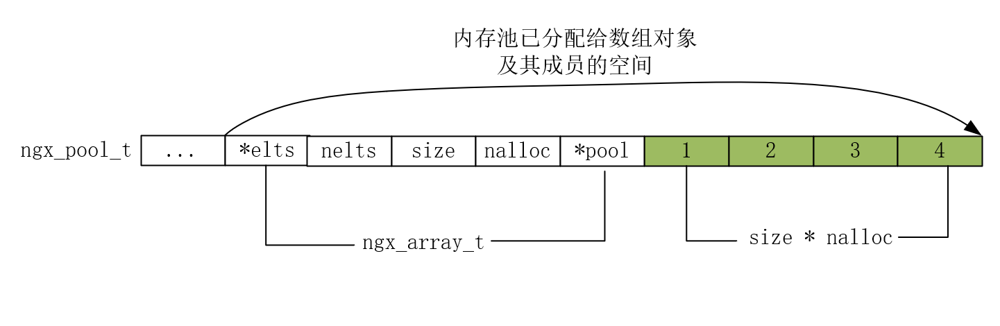
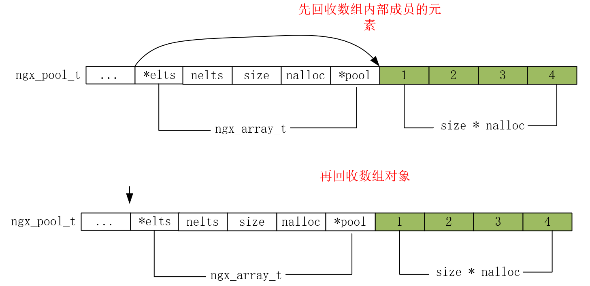
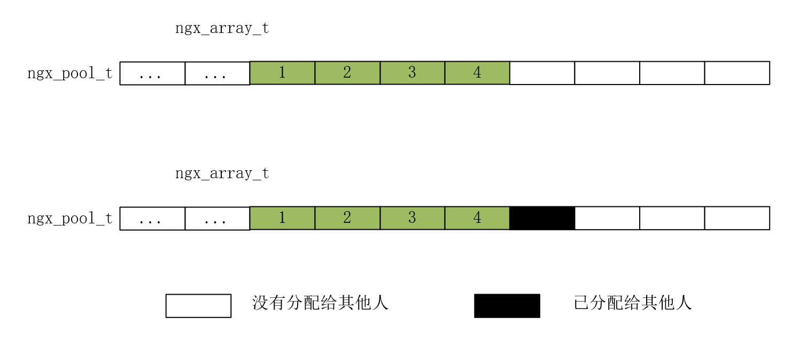
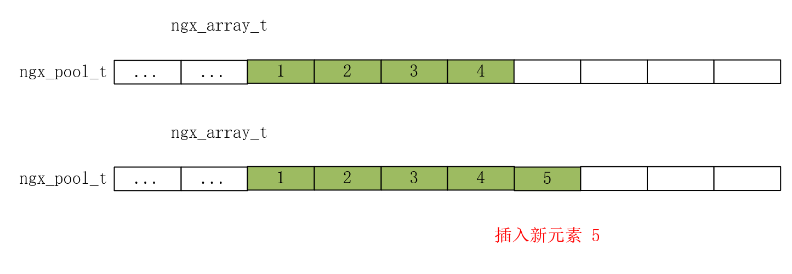
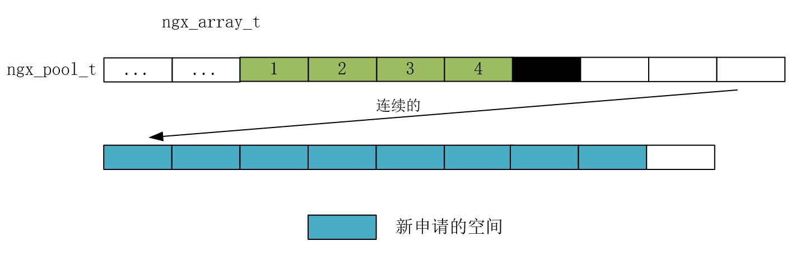
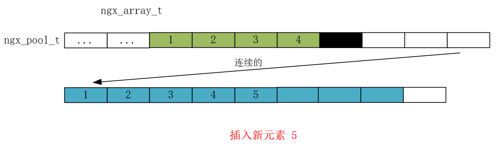

```tex
src/core/ngx_array.h
src/core/ngx_array.c
```

ngx_array_t结构体：

```c
typedef struct {
    void        *elts;  	// 指向数组第一个元素指针
    ngx_uint_t   nelts; 	// 数组中已有元素个数，添加元素就在该下标添加即可
    size_t       size;  	// 每个元素的大小
    ngx_uint_t   nalloc;  	// 元素个数
    ngx_pool_t  *pool;	    //所使用的内存所在的内存池。
} ngx_array_t;
```

## ngx_array_create

```c
ngx_array_t *
ngx_array_create(ngx_pool_t *p, ngx_uint_t n, size_t size)
{
    ngx_array_t *a;

    a = ngx_palloc(p, sizeof(ngx_array_t));	// 创建 数组对象
    if (a == NULL) {
        return NULL;
    }

    if (ngx_array_init(a, p, n, size) != NGX_OK) {	// 初始化数组对象内部成员
        return NULL;
    }

    return a;
}
```

## ngx_array_init

```c
static ngx_inline ngx_int_t
ngx_array_init(ngx_array_t *array, ngx_pool_t *pool, ngx_uint_t n, size_t size)
{
    array->nelts = 0;
    array->size = size; // 数组中一个元素的大小
    array->nalloc = n;  // 分配元素个数
    array->pool = pool;

    array->elts = ngx_palloc(pool, n * size); // 从内存池中申请 n（元素个数）* size（元素大小） 内存大小
    if (array->elts == NULL) {
        return NGX_ERROR;
    }

    return NGX_OK;
}
```

示意图如下：



nelts 为 0，目前还没有添加任何元素

nalloc 为 4，目前数组中可容纳 4 个元素

## ngx_array_destroy

```c
void
ngx_array_destroy(ngx_array_t *a)
{
    ngx_pool_t  *p;

    p = a->pool;

    // 回收数组中的元素 
    if ((u_char *) a->elts + a->size * a->nalloc == p->d.last) {
        p->d.last -= a->size * a->nalloc;
    }

    // 回收数组对象本身
    if ((u_char *) a + sizeof(ngx_array_t) == p->d.last) {
        p->d.last = (u_char *) a;
    }
}
```

当前数组内存布局示意图：



回收当前内存布局示意图：



其实我们也看到 destory 只是更改偏移量，并没有实际回收内存。

## ngx_array_push

```c
void *
ngx_array_push(ngx_array_t *a)
{
    void        *elt, *new;
    size_t       size;
    ngx_pool_t  *p;

    if (a->nelts == a->nalloc) {  // 空间已满

        /* the array is full */

        size = a->size * a->nalloc; // 数组总大小

        p = a->pool;

        if ((u_char *) a->elts + size == p->d.last  // 2
            && p->d.last + a->size <= p->d.end)     // 1
        {
            // 1-原内存大小支持分配一个元素
            // 2-要求原内存池的空间还支持连续，即没有被内存池分配给其他人导致被污染（即无法让新增数组元素连续的跟在原数组后面）
            p->d.last += a->size;
            a->nalloc++;

        } else {
            // 新增元素导致无法在原数组后面继续添加
            // 那就在重新在该内存池中找一块连续的，并且两倍扩容
            new = ngx_palloc(p, 2 * size);
            if (new == NULL) {
                return NULL;
            }

            ngx_memcpy(new, a->elts, size);
            a->elts = new;
            a->nalloc *= 2;
        }
    }

    // 添加元素
    elt = (u_char *) a->elts + a->size * a->nelts;
    a->nelts++;

    return elt;
}
```

如果空间没有满，可以直接在元素后面继续添加。

如果空间不足以容纳新元素，我们看看 Nginx 的数组是如何处置的？



内存池原先分配的数组，后面未分配的空间也没有分配给其他人，即能够保证原数组的连续性，当前内存池新增一个元素也能够容得下。那就不需要重新找一块连续的内存，直接向内存池申请后面一块紧挨着的内存，用于添加新元素。



如果后面未分配的空间已经分配给其他人，无法保证数组的连续性，那么需要在这个内存池中重新找一块连续的内存，并且进行两倍扩容，失败就返回 NULL，表示插入失败。



申请成功，就把原数组中的内容拷贝过来，在把新元素添加进去，并更新成员 elts 指向最新的内存。



ngx_array_push_n 没有什么好讲的，就是添加多个相同的元素，添加和扩容思路同上。